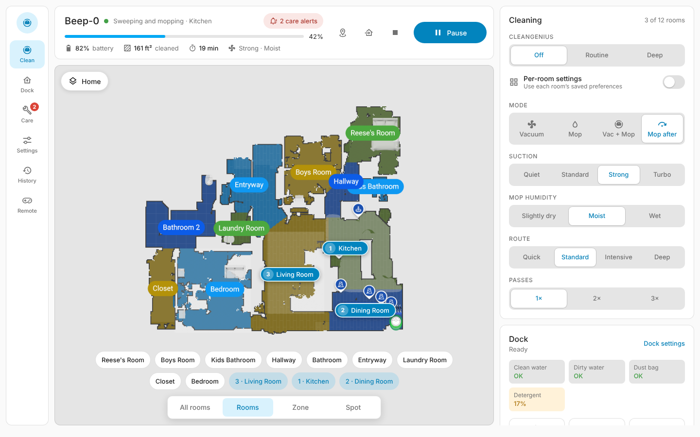
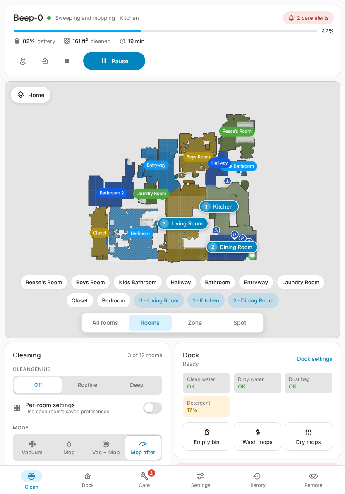
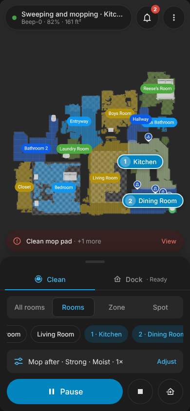
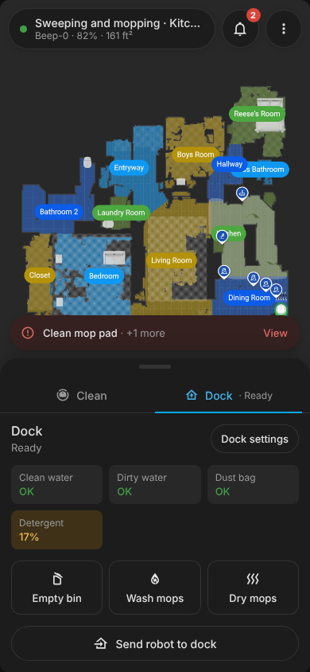

# Dreame Vacuum Panel Card

A full-screen Home Assistant card for Dreame robot vacuums, built for the
[Tasshack/dreame-vacuum](https://github.com/Tasshack/dreame-vacuum) integration.

It gives you one place to see the map, pick rooms, draw zones, run the dock, keep up with
maintenance and change every setting. It adapts to desktop, tablet and phone, and it uses
your Home Assistant theme so it looks at home on any dashboard.

[![hacs][hacs-badge]][hacs-url] ![license][license-badge]



| Tablet | Phone | Phone · Dock |
| --- | --- | --- |
|  |  |  |

## Features

- **Three layouts in one card.** The card picks a layout from its own width:
  - **Desktop** (1080 px and up): a side menu, the map, and cleaning and dock controls side by side.
  - **Tablet** (600–1079 px): map on top, controls underneath, tab bar at the bottom.
  - **Phone** (under 600 px): the map fills the screen and a pull-up panel holds the controls.
    The panel has **Clean** and **Dock** tabs.
- **Your real map.** The card shows the integration's map camera and draws on top of it
  using the map's calibration points. Tap a room on the map or in the room list to select it.
  Rooms are numbered in the order you pick them.
- **All rooms, Rooms, Zone or Spot.** Drag to draw a zone, or tap to place a spot, then choose
  1–3 passes.
- **Cleaning settings.** CleanGenius, per-room settings, cleaning mode, suction, mop humidity
  (or water volume), route and passes. These only appear when your robot supports them.
- **Dock.** Water tank, dust bag and detergent status, plus Empty bin, Wash mops, Dry mops and
  every dock setting.
- **Care alerts.** A badge, a bell and a reminder bar show up when a part runs low or the
  robot reports a fault. You can reset the counter, clear the warning, or snooze the alert
  for a day.
- **Settings, generated from your robot.** Every switch, select, number and time entity the
  integration creates is grouped into Cleaning, Mopping, Carpet, Obstacle avoidance,
  Schedule & sound, General and Rooms. If your model has it, it shows up.
- **History.** Recent cleaning runs with their maps, plus obstacle photos.
- **Remote control.** A direction pad you press and hold to drive the robot, with three speeds.
- **Blends in.** The card uses your theme's colors, corner radius and font, and works in light
  and dark mode. It has no external dependencies: one JavaScript file, no build step.

## Requirements

- Home Assistant 2024.8 or newer (the visual editor needs 2025.1 or newer; YAML works on older versions)
- The [dreame-vacuum](https://github.com/Tasshack/dreame-vacuum) integration with map support turned on
  (the card reads the `camera.<name>_map` entity)

## Installation

### HACS (recommended)

1. In HACS, open the menu (⋮) and choose **Custom repositories**.
2. Add `https://github.com/The-Croz/dreame-vacuum-panel-card` with the type **Dashboard**.
3. Search for **Dreame Vacuum Panel Card** and download it.
4. Reload your browser.

### Manual

1. Copy `dist/dreame-vacuum-panel-card.js` to `<config>/www/dreame-vacuum-panel-card.js`.
2. Go to **Settings → Dashboards → ⋮ → Resources** and add
   `/local/dreame-vacuum-panel-card.js` as a **JavaScript module**.
3. Reload your browser.

## Setup

The card works best as the only card in a **Panel** view:

```yaml
type: panel
title: Vacuum
path: vacuum
icon: mdi:robot-vacuum
cards:
  - type: custom:dreame-vacuum-panel-card
    entity: vacuum.my_robot
```

You can also add it to a Sections dashboard. Give it the full width and a height:

```yaml
type: custom:dreame-vacuum-panel-card
entity: vacuum.my_robot
height: 720px
grid_options:
  columns: full
```

More examples are in [`examples/`](examples).

## Options

| Option | Default | Description |
| --- | --- | --- |
| `entity` | **required** | Your Dreame `vacuum.*` entity. |
| `map_entity` | auto | The map camera. Found automatically (`camera.<name>_map`). |
| `title` | device name | Name shown at the top of the card. |
| `layout` | `auto` | `auto`, `desktop`, `tablet` or `phone`. `auto` picks a layout from the card's width. |
| `height` | screen height | Any CSS height, for example `720px` or `100vh`. |
| `default_target` | `all` | What the cleaning target starts as: `all` or `rooms`. |
| `care_warning` | `20` | At or below this %, a part shows an amber care alert. |
| `care_critical` | `10` | At or below this %, the alert turns red. |
| `accent_color` | theme primary | Any CSS color, if you want the card to stand out from your theme. |
| `entities` | — | Overrides for entities the card can't find, for example `select.suction_level: select.robot_fan`. |

## How it works

- **Finding entities.** The card finds every entity on the same device as your vacuum and
  matches them by their entity ID (for example `select.<name>_suction_level`). If you renamed
  some, map them back with the `entities:` option.
- **Labels.** Option and state labels come from Home Assistant's own translations, so they
  follow your language.
- **Units.** Areas and times use each sensor's own unit, such as ft² or m².
- **Starting a clean.** The card calls the integration's services:
  - `dreame_vacuum.vacuum_clean_segment` for rooms
  - `dreame_vacuum.vacuum_clean_zone` for zones
  - `dreame_vacuum.vacuum_clean_spot` for spots
  - `vacuum.start` for all rooms
  - `vacuum.pause`, `vacuum.stop` and `vacuum.return_to_base` for the other buttons
- **Care actions.**
  - Resetting a part presses its `button.<name>_reset_*` entity, or falls back to `dreame_vacuum.vacuum_reset_consumable`.
  - Clearing a warning presses `button.<name>_clear_warning`.
  - Snoozing is stored in your browser.
- **Remote control.** Holding a direction calls `dreame_vacuum.vacuum_remote_control_move_step`
  repeatedly until you let go.
- **Risky buttons.** Buttons that start mapping, drain the tank or repair the dock ask you to
  confirm first.

## Troubleshooting

- **"No map yet."** Make sure the integration's map camera (`camera.<name>_map`) is enabled
  and has a picture. If it has a different name, set `map_entity`.
- **Selections land in the wrong place.** The card uses the camera's `calibration_points`.
  If you rotate the map in the integration, give the camera a moment to update.
- **A setting is missing.** Check that the entity is enabled in **Settings → Entities**.
  Disabled entities are skipped.

## Roadmap

- Editing the map (split and merge rooms, no-go zones, virtual walls)
- Several zones in one run
- Translations for the card's own labels

## Credits

- Built on the excellent [dreame-vacuum](https://github.com/Tasshack/dreame-vacuum) integration by Tasshack.
- Icons are [Material Design Icons](https://pictogrammers.com/library/mdi/), which ship with Home Assistant.
- This project is not affiliated with Dreame Technology.

## License

MIT

[hacs-badge]: https://img.shields.io/badge/HACS-Custom-41BDF5.svg
[hacs-url]: https://hacs.xyz/docs/faq/custom_repositories
[license-badge]: https://img.shields.io/badge/license-MIT-blue.svg
